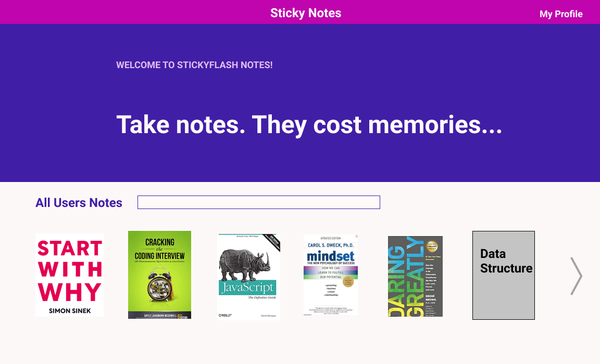

## User Story
- non loggedin users only see the home page
- user should sign in to be able to access website content
- user has a profile that can create two types of note collections related to a book or subject of study (sticky notes & Flash cards)
- user can access other users note collections on home page
- user can access her/his note collections on profile
- user can post/edit/delete one note collection (book or subject of study)
- user can post/edit/delete each note in a note collection 

#### stretch goal
- make some notes collections private and some public

## ERD

## Wireframe

